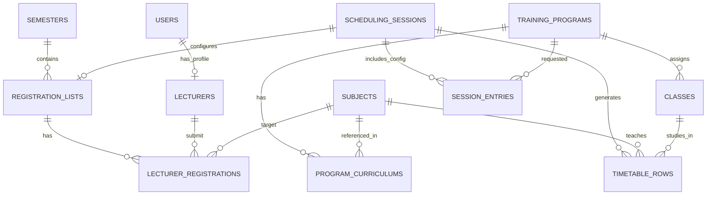

# Tài Liệu Kỹ Thuật (Technical Handover Doc) - CSDL TKB v2.0
**Dự Án:** Hệ thống Quản lí & Auto-Assign TKB  
**Trạng Thái:** Cập nhật mới nhất sau đợt tái cấu trúc (Chuyên ngành & Lớp học)

Bản tài liệu cung cấp tài liệu chi tiết 100% CSDL hiện tại phục vụ quá trình làm việc với Workspace Sinh TKB tự động.

---

## 1. Sơ Đồ Cấu Trúc Tổng Thể (ERD)
Dưới đây là sơ đồ Mermaid Entity Relationship (được đơn giản hóa những trường thứ yếu) cho cái nhìn tổng quan:

---

## 2. Chi Tiết Các Thực Thể (Tables)

### Phân Hệ 1: Cốt Lõi Hệ Thống & Con Người

#### `users` (Tài Khoản)
| Column | Type | Constraints | Description |
| :--- | :--- | :--- | :--- |
| `user_id` | Integer | PK, Auto | ID tự tăng |
| `username` | String(50) | Unique | Tên đăng nhập |
| `password_hash` | String(255) | Not Null | Mật khẩu băm |
| `email` | String(100) | Unique | - |
| `role` | Enum | `ADMIN`, `SCHEDULER`, `LECTURER` | Phân quyền truy cập |

#### `lecturers` (Giảng Viên)
| Column | Type | Constraints | Description |
| :--- | :--- | :--- | :--- |
| `lecturer_id` | Integer | PK, Auto | ID tự tăng |
| `user_id` | Integer | FK(users) | Mỗi user LECTURER có 1 profile ở đây (1-1) |
| `full_name` | String(100) | Not Null | Họ và tên |
| `lecturer_code` | String(20) | Unique | Mã GV |
| `type` | Enum | `FULL_TIME` (Cơ hữu), `VISITING` (Thỉnh giảng) | Loại nhân sự |
| `max_quota` | Integer | Dự phòng | Giới hạn số tiết tối đa / kì (nếu áp dụng Constraint) |

---

### Phân Hệ 2: Quản Lý Khung CTĐT & Danh Mục Môn Cốt Lõi 

> [!NOTE]
> Phân hệ này là trung tâm của thay đổi logic gần đây. Xóa bỏ cấu trúc ngành tĩnh rườm rà, thay bằng "Training Program" cực kì uyển chuyển cho cả Phân nhánh chuyên ngành nhỏ.

#### `subjects` (Môn Học)
| Column | Type | Constraints | Description |
| :--- | :--- | :--- | :--- |
| `subject_id` | Integer | PK, Auto | ID |
| `subject_code` | String(20) | Unique | Mã môn (Thường đọc từ Excel) |
| `subject_name` | String(200) | Not Null | VD: Lập trình Mobile |
| `credits` | Integer | Not Null | Tổng tín |
| `theory_credits` | Integer | Default: 0 | Tín Lí Thuyết (Trọng số a) |
| `practice_credits`| Integer | Default: 0 | Tín Thực Hành (Trọng số b) |
| `theory_hours` | Integer | Default: 0 | Tổng tiết Lí thuyết (= a * 15) |
| `practice_hours` | Integer | Default: 0 | Tổng tiết Thực hành (= b * 15) |

#### `training_programs` (Khung Chương Trình Đào Tạo)
Đóng vai trò là cái **Chuyên ngành gốc**. Một Ngành lớn có thể có n Khung CTĐT khác nhau.
| Column | Type | Constraints | Description |
| :--- | :--- | :--- | :--- |
| `id` | Integer | PK, Auto | - |
| `program_code` | String(50) | Unique | Ví dụ `CNTT_PM_19` |
| `name` | String(200) | Not Null | Tên dài: "CNTT - PM Khóa 19" |
| `department_major`| String(50) | | Dùng quản lý cục bộ: "CNTT" |
| `batch` | String(10) | | "19" |

#### `program_curriculums` (Mapping CTĐT x Môn Học)
| Column | Type | Constraints | Description |
| :--- | :--- | :--- | :--- |
| `id` | Integer | PK, Auto | - |
| `program_id` | Integer | FK(training_programs) | CASCADE Delete |
| `semester_index` | Integer | Not Null | Môn này học ở học kỳ thứ mấy (1..10) |
| `subject_id` | Integer | FK(subjects) | Mối qua hệ M-N |

---

### Phân Hệ 3: Quản Lý Lớp & Nguyện Vọng Giảng Dạy

#### `classes` (Lớp Cố Định)
| Column | Type | Constraints | Description |
| :--- | :--- | :--- | :--- |
| `class_id` | Integer | PK, Auto | - |
| `class_name` | String(50) | Not Null | VD: "CNTT 19-01" |
| `department_major`| String(50) | Indexed | Dùng để Filter: "CNTT" |
| `batch` | String(10) | Indexed | Dùng để Filter: "19" |
| `program_id` | Integer | FK(training_programs) |  NULL = Chưa gán định hướng Khung |

#### `registration_lists` (Đợt Khảo Sát Nguyện Vọng)
| Column | Type | Constraints | Description |
| :--- | :--- | :--- | :--- |
| `list_id` | Integer | PK | - |
| `list_name` | String(200) | | Tên đợt mở đăng ký |
| `semester_id` | Integer | FK(semesters) | Ràng buộc vào học kì nào |
| `description` | String(500) | | Ghi chú |

#### `lecturer_registrations` (Chi Tiết 1 Dòng Môn Đăng Ký)
| Column | Type | Constraints | Description |
| :--- | :--- | :--- | :--- |
| `registration_id` | Integer | PK | - |
| `list_id` | Integer | FK(reg_lists) | Thuộc List khảo sát nào |
| `lecturer_id` | Integer | FK(lecturers) | GV nào đăng ký |
| `subject_id` | Integer | FK(subjects) | Xin dạy môn học nào |
| `is_main_lecturer`| Boolean | Default: True | `1` (Dạy Lí thuyết chính) / `0` (Dạy TH) |

---

### Phân Hệ 4: WORKSPACE THỜI KHÓA BIỂU ĐỘNG (Auto-Gen)

Đây là phân hệ thiết yếu nhất phục vụ cho Giai đoạn cuối (Tạo Session, Phân công).

#### `scheduling_sessions` (Phiên / Đợt Khởi tào TKB)
| Column | Type | Constraints | Description |
| :--- | :--- | :--- | :--- |
| `session_id` | Integer | PK, Auto | - |
| `plan_name` | String(200) | Not Null | VD: TKB HK1 2026-2027 |
| `registration_list_id` | Integer| FK(reg_lists) | Liên kết với DS Đăng ký để so sánh NV |
| `status` | Enum | DRAFT, ACTIVE, DONE | Trạng thái Session |

#### `session_entries` (Cấu hình Đầu Mức Của Session)
Wizard Cấu hình yêu cầu Cán bộ điền 2 Cột: *"Tham chiếu Khung CTĐT nào? Học kì bao nhiêu?"*
| Column | Type | Constraints | Description |
| :--- | :--- | :--- | :--- |
| `id` | Integer | PK | - |
| `session_id` | Integer | FK(sessions) | - |
| `program_id` | Integer | FK(programs) | Khung nào tham gia chạy auto-gen? |
| `semester_index` | Integer | Not Null | Cắt tiết ở Kỳ thứ mấy trong Khung đó? |

> [!IMPORTANT]  
> Thuật toán Auto Gen sẽ lấy `program_id` rà xem có những `Classes` (lớp học) nào đang xài cấu trúc này. Xong nó lại lấy `program_id` rà xem có `Subjects` (Môn học) nào ở học kỳ `semester_index` này.  
> `Kết Quả` = CROSS JOIN Giữa chúng sinh ra vô số **TimetableRow**.

#### `timetable_rows` (Timetable Grid Thực Tế / Workspace Rows)
Đại diện cho 1 dòng chéo Môn học x Lớp Học được rải ra màn hình.
| Column | Type | Constraints | Description |
| :--- | :--- | :--- | :--- |
| `row_id` | Integer | PK, Auto | - |
| `session_id` | Integer | FK(sessions) | Ràng buộc vào Workspace nào |
| `class_name` | String(50) | Not Null | Tên hiển thị Cột B trên excel cũ |
| `subject_id` | Integer | FK(subjects) | Liên kết cứng về ID môn |
| `fixed_shift` | String(50) | Nullable | **Nhu cầu mới**: Chọn thủ công Sáng/Chiều cố định |
| `room_type` | String(50) | Nullable | **Nhu cầu mới**: Cố định yêu cầu Loại phòng (VD: Phòng máy) |
| `morning_day` | String(50) | Nullable | Lưu thuật toán output: "S-T2" |
| `afternoon_day`| String(50) | Nullable | Lưu thuật toán output: "C-T7" |
| `main_lecturer_id`| Integer| FK(lecturers)| Ai sẽ dạy lí thuyết? (Thuật toán Auto Điền vào) |
| `prac_lecturer_id`| Integer| FK(lecturers)| Ai sẽ dạy thực hành? (Thuật toán Auto Điền vào) |

---

Tài liệu này bao quát 100% tình trạng CSDL tại thời điểm hoàn tắt Refactoring "Khung Chương Trình & Chuyên Ngành Mở Rộng". Bạn có thể căn cứ vào các liên kết khóa ngoại (Foreign Key) ở Bảng `TimetableRow` (Workspace)  và `LecturerRegistration` để triển khai việc Phân Công Auto!
