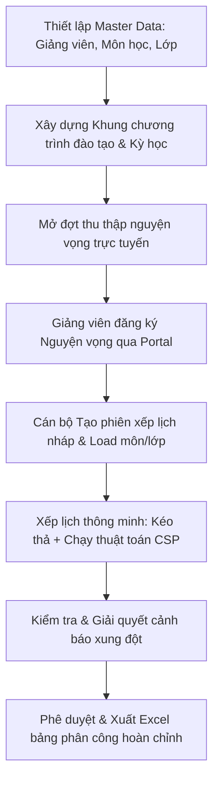

# CHƯƠNG 1. CƠ SỞ LÝ THUYẾT

## 1.1. Giới thiệu

### 1.1.1. Bối cảnh và sự cần thiết của hệ thống quản lý phân công giảng dạy

Trong kỷ nguyên chuyển đổi số và phát triển mạnh mẽ của cách mạng công nghiệp 4.0, việc ứng dụng công nghệ thông tin vào công tác quản trị và vận hành giáo dục đã trở thành một xu thế tất yếu của các trường đại học trên toàn cầu nói chung và tại Việt Nam nói riêng. Một trong những nhiệm vụ cốt lõi và phức tạp nhất trong công tác quản lý đào tạo tại các cơ sở giáo dục đại học chính là lập kế hoạch đào tạo, xếp thời khóa biểu và phân công giảng dạy cho đội ngũ giảng viên. Công việc này không chỉ đòi hỏi sự chính xác tuyệt đối mà còn phải đảm bảo tính tối ưu nhằm cân bằng giữa nguồn lực cơ sở vật chất, năng lực chuyên môn của đội ngũ giảng viên và mục tiêu chất lượng chương trình đào tạo của nhà trường.

Đối với Khoa Công nghệ Thông tin thuộc Trường Đại học Đại Nam, hoạt động giảng dạy mang những đặc thù chuyên ngành sâu sắc và phức tạp hơn rất nhiều so với các khoa đào tạo lý thuyết thuần túy. Chương trình đào tạo ngành Công nghệ Thông tin tại Đại học Đại Nam được thiết kế định hướng ứng dụng thực tiễn cao, do đó hầu hết các học phần chuyên ngành đều được chia làm hai cấu phần rõ rệt bao gồm phần lý thuyết giảng dạy tại phòng học truyền thống và phần thực hành học tập tại các hệ thống phòng máy chuyên dụng. Sự phân tách mang tính đặc thù này dẫn đến việc lập kế hoạch giảng dạy phải đối mặt với bài toán điều phối kép vô cùng phức tạp. Một mặt, ban quản lý khoa phải bố trí song hành cả giảng viên dạy lý thuyết chính và giảng viên phụ trách hướng dẫn thực hành phòng máy cho cùng một lớp học phần. Mặt khác, các học phần thực hành đòi hỏi sự tương thích tuyệt đối về cấu hình phòng máy chuyên biệt và hệ thống phần mềm cài đặt sẵn chuyên biệt cho từng môn học như lập trình web, an toàn thông tin, mạng máy tính hay trí tuệ nhân tạo. Thêm vào đó, sự khác biệt sâu sắc về định mức giờ giảng cùng quyền hạn phân công giữa đội ngũ giảng viên cơ hữu chịu ràng buộc định mức tiết dạy tiêu chuẩn theo quy chế và lực lượng giảng viên thỉnh giảng từ doanh nghiệp vốn có quỹ thời gian biến động liên tục cũng làm gia tăng độ phức tạp của bài toán điều hành.

Thực tế hiện nay tại Khoa Công nghệ Thông tin – Trường Đại học Đại Nam, quy trình thu thập nguyện vọng và phân công giảng dạy vẫn phụ thuộc rất lớn vào các công cụ thủ công truyền thống như bảng tính Excel cá nhân và trao đổi trực tiếp qua các ứng dụng tin nhắn. Cách tiếp cận mang tính chắp vá này bộc lộ những hạn chế và bất cập nghiêm trọng đối với hiệu quả vận hành của Khoa. Trước hết, hiện tượng quá tải thông tin là không thể tránh khỏi khi cán bộ giáo vụ phải tự mình xử lý và tổng hợp hàng trăm nguyện vọng của giảng viên cho hàng chục môn học với nhiều lớp học phần khác nhau trên các bảng tính Excel rời rạc. Điều này dễ dẫn đến tình trạng nhầm lẫn số liệu hoặc nghiêm trọng hơn là chồng chéo lịch giảng dạy như việc một giảng viên bị xếp dạy hai lớp khác nhau trong cùng một buổi học hoặc một lớp học bị xếp hai môn học đồng thời. Bên cạnh đó, việc kiểm soát các định mức và ràng buộc theo quy chế đào tạo cũng gặp rất nhiều trở ngại. Quy chế quy định rõ giảng viên cơ hữu phải đạt định mức tiết dạy tiêu chuẩn tối thiểu là một trăm sáu mươi tiết và giới hạn số tiết trần tối đa là hai trăm năm mươi tiết trong học kỳ để bảo đảm sức khỏe và chất lượng sư phạm. Việc tính toán thủ công lượng giờ giảng quy đổi cho từng người theo thời gian thực mỗi khi có sự thay đổi lịch dạy là một thách thức cực kỳ lớn đối với cán bộ giáo vụ khoa.

Hơn thế nữa, sự thiếu vắng một kênh giao tiếp tập trung và minh bạch cũng làm giảm tính tương tác hai chiều giữa Khoa và đội ngũ giảng viên. Giảng viên không có một cổng thông tin chuyên dụng để theo dõi các đợt mở đăng ký nguyện vọng, không thể chủ động đăng ký trực tuyến theo các vai trò giảng dạy mong muốn, đồng thời gặp khó khăn trong việc phản hồi các ca học bị bận cố định, dẫn đến tính thụ động trong công tác chuẩn bị bài giảng. Tất cả các yếu tố trên cộng hưởng lại làm cho hiệu suất lập kế hoạch bị kéo giảm đáng kể. Mỗi khi có biến động nhân sự hoặc thay đổi khung chương trình học kỳ từ phía nhà trường, cán bộ xếp lịch buộc phải rà soát lại toàn bộ hệ thống file Excel từ đầu, tiêu tốn nhiều ngày làm việc quý báu và dễ gây chậm trễ cho tiến độ chung của toàn hệ thống.

Nhận thức rõ những bất cập trên, việc **"Xây dựng hệ thống lập kế hoạch và giảng dạy cho Khoa Công nghệ Thông tin – Trường Đại học Đại Nam"** là một yêu cầu vô cùng cấp thiết và mang tính đột phá. Hệ thống được xây dựng nhằm mục đích tin học hóa toàn diện quy trình phân công giảng dạy: từ khâu nhập dữ liệu chương trình đào tạo, quản lý hồ sơ giảng viên, mở đợt đăng ký nguyện vọng trực tuyến, xếp lịch tự động hóa dựa trên giải thuật thông minh (CSP), cho đến giao diện kéo thả Workspace trực quan thời gian thực và xuất file báo cáo chuẩn hóa. Đây sẽ là bước tiến quan trọng góp phần hiện đại hóa công tác giáo vụ, tối ưu hóa nguồn lực nhân sự và nâng cao chất lượng đào tạo theo đúng định hướng chuyển đổi số toàn diện của Trường Đại học Đại Nam.

---

### 1.1.2. Lợi ích của hệ thống đối với Nhà trường, Cán bộ quản lý và Giảng viên

Hệ thống lập kế hoạch và giảng dạy sau khi được xây dựng và triển khai thực tế sẽ mang lại những giá trị thặng dư to lớn và lợi ích thiết thực cho ba nhóm đối tượng cốt lõi tham gia vào quy trình đào tạo tại Khoa Công nghệ Thông tin – Trường Đại học Đại Nam:

#### A. Đối với Nhà trường (Trường Đại học Đại Nam)
Đối với Nhà trường, hệ thống đóng vai trò quan trọng trong việc chuẩn hóa và đồng bộ hóa toàn diện quy trình quản trị giáo dục, thiết lập một quy trình phân công giảng dạy khoa học, nhất quán và hạn chế tối đa sự phân mảnh thông tin bằng cách lưu trữ tập trung toàn bộ dữ liệu gốc. Đồng thời, chất lượng đào tạo và giảng dạy cũng được nâng cao rõ rệt nhờ cơ chế kiểm soát chặt chẽ định mức tiết dạy chuẩn và số lớp giảng dạy tối đa của giảng viên, giúp ngăn chặn tình trạng quá tải và đảm bảo giảng viên có đủ thời gian đầu tư giáo án chất lượng cao. Bên cạnh đó, việc phân bổ lịch học tương thích với yêu cầu phòng máy thực hành hay phòng học thường giúp nhà trường tối ưu hóa tối đa nguồn lực cơ sở vật chất phòng máy. Cuối cùng, hệ thống cung cấp một nguồn cơ sở dữ liệu động, trực quan phục vụ đắc lực cho công tác báo cáo, thi đua khen thưởng và kiểm định chất lượng giáo dục định kỳ của nhà trường.

#### B. Đối với Cán bộ quản lý (Giáo vụ Khoa và Cán bộ xếp lịch)
Đối với Cán bộ quản lý, đặc biệt là giáo vụ Khoa và cán bộ trực tiếp xếp lịch, hệ thống mang lại sự giải phóng sức lao động to lớn khi thay thế các bảng tính phức tạp bằng một quy trình tự động hóa mượt mà chỉ trong vài giờ làm việc. Thuật toán thông minh thỏa mãn ràng buộc tích hợp sẵn giúp tự động tính toán và điền đầy phần lớn thời khóa biểu nháp, hỗ trợ đắc lực cho các quyết định phân công dựa trên chiến lược bão hòa hoặc cân bằng tải. Trải nghiệm làm việc cũng được nâng tầm nhờ giao diện Workspace kéo thả trực quan kết hợp cơ chế phát hiện xung đột tức thị, giúp triệt tiêu hoàn toàn các lỗi chủ quan như trùng lịch buổi dạy. Thao tác nạp dữ liệu gốc từ file Excel của trường và kết xuất bảng phân công hoàn chỉnh ra file báo cáo chuẩn hóa được thực hiện nhanh chóng chỉ với một cú click chuột, đẩy nhanh tiến độ làm việc một cách tối đa.

#### C. Đối với Giảng viên (Giảng viên Cơ hữu và Giảng viên Thỉnh giảng)
Đối với đội ngũ Giảng viên, hệ thống cung cấp một cổng thông tin tự phục vụ chuyên nghiệp và thuận tiện, cho phép họ chủ động truy cập từ xa để theo dõi các đợt nguyện vọng đang mở, tick chọn môn đăng ký và lựa chọn vai trò dạy lý thuyết hoặc thực hành phù hợp với thế mạnh chuyên môn. Quyền lợi và sự cân bằng giữa công việc giảng dạy với công việc chuyên môn bên ngoài được bảo đảm tối đa nhờ tính năng đăng ký lịch bận trực tuyến, giúp hệ thống tự động loại trừ các slot bận khi xếp lịch. Hơn nữa, việc minh bạch hóa phân công giúp giảng viên dễ dàng theo dõi trực quan số tiết giảng dạy thực tế được gán của mình để đối chiếu với định mức tiêu chuẩn, tạo tâm lý thoải mái và nâng cao tinh thần cống hiến cho sự nghiệp giáo dục chung của nhà trường.

---

## 1.2. Các khái niệm cơ bản

### 1.2.1. Định nghĩa hệ thống quản lý lịch biểu và nguyện vọng giảng dạy

Hệ thống quản lý lịch biểu và nguyện vọng giảng dạy trực tuyến là một giải pháp công nghệ thông tin tích hợp dữ liệu, quy trình và thuật toán, được xây dựng chuyên biệt nhằm tối ưu hóa công tác lập thời khóa biểu và phân công nguồn lực giảng dạy. Về mặt bản chất kỹ thuật, hệ thống hoạt động như một nền tảng quản trị trung tâm kết nối ba thực thể cốt lõi trong môi trường học thuật đại học bao gồm khung chương trình đào tạo, cơ sở vật chất lớp học và con người giảng viên. Hệ thống cho phép tin học hóa toàn diện quy trình phân công thông qua việc thiết lập các mô hình dữ liệu động, tiêu biểu là dữ liệu nguyện vọng giảng dạy đại diện cho tập hợp nguyện vọng đăng ký chủ động của giảng viên về môn học chuyên môn, vai trò mong muốn và lịch bận cá nhân. Đi kèm với đó là dữ liệu lịch biểu tương tác thể hiện cho một phiên làm việc cụ thể của cán bộ giáo vụ, chứa danh sách các dòng thời khóa biểu dự kiến phát sinh từ việc kết hợp giữa số lượng lớp học thực tế và khung chương trình đào tạo của từng ngành trong kỳ học hiện tại.

---

### 1.2.2. Các thành phần chính trong quy trình phân công giảng dạy

Quy trình phân công giảng dạy là một chuỗi nghiệp vụ liên tục, có mối quan hệ chặt chẽ từ khâu chuẩn bị dữ liệu đầu vào cho đến khâu phê duyệt và ban hành thời khóa biểu. Một hệ thống lập kế hoạch giảng dạy chuyên nghiệp cần mô phỏng và tự động hóa toàn diện các thành phần này:

Quy trình phân công giảng dạy trên hệ thống thực tế được tổ chức thành một chuỗi nghiệp vụ liên tục và khép kín. Quy trình khởi đầu từ khâu thiết lập và chuẩn bị dữ liệu gốc để định nghĩa các danh mục thực thể cơ bản như giảng viên, môn học, lớp học cố định và phòng máy thực hành chuyên dụng. Tiếp theo là công tác quản lý khung chương trình đào tạo và phân bổ kỳ học, định vị chính xác vị trí của từng môn học vào các học kỳ tương ứng để hệ thống tự động nhận diện danh sách môn cần mở trong kỳ. Từ cơ sở dữ liệu đó, cán bộ xếp lịch sẽ tiến hành mở đợt thu thập nguyện vọng trực tuyến gắn liền với học kỳ cụ thể để thu thập nguyện vọng của giảng viên thông qua cổng thông tin cá nhân dành riêng cho họ.

Khi đợt nguyện vọng kết thúc, cán bộ quản lý sẽ khởi tạo phiên xếp lịch mới và tự động sinh ra bảng thời khóa biểu nháp từ việc đối chiếu các khung đào tạo và kỳ học được lựa chọn. Tại không gian làm việc xếp lịch thông minh, cán bộ giáo vụ sẽ phối hợp giữa việc chạy thuật toán phân công tự động thỏa mãn các ràng buộc cứng mềm và thực hiện thao tác kéo thả thủ công các thẻ giảng viên từ bể đề xuất để tinh chỉnh phương án phân công tối ưu. Trong suốt quá trình tương tác này, hệ thống liên tục rà soát dữ liệu để phát hiện các xung đột và hiển thị cảnh báo lỗi tức thời, giúp cán bộ kịp thời xử lý trước khi tiến hành phê duyệt, khóa dữ liệu và xuất bản bảng phân công hoàn chỉnh ra file Excel gửi nhà trường.

---

### 1.2.3. Các tiêu chí, ràng buộc trong việc xếp lịch (Giờ chuẩn, loại giảng viên, số lớp tối đa)

Xếp thời khóa biểu đại diện cho một bài toán tối ưu tổ hợp cực kỳ phức tạp, đòi hỏi toàn bộ các tiêu chí và quy chế nghiệp vụ của nhà trường phải được mã hóa thành các ràng buộc kỹ thuật rõ ràng. Tiêu chí đầu tiên là việc quy đổi giờ chuẩn cho các cấu phần lý thuyết và thực hành, trong đó mỗi môn học có số tín chỉ và thời lượng tiết dạy thực tế khác nhau được tích lũy theo thời gian thực để tính toán tổng tải giảng dạy của giảng viên. Cùng với đó là việc quản lý và phân nhóm loại giảng viên bao gồm giảng viên cơ hữu chịu sự quản lý trực tiếp của trường với định mức giờ dạy tối thiểu bắt buộc là một trăm sáu mươi tiết để đảm bảo định mức lao động khoa học, và giảng viên thỉnh giảng từ doanh nghiệp không bị giới hạn định mức tối thiểu nhưng chịu sự kiểm soát nghiêm ngặt về lịch bận cá nhân và trần tiết dạy thỏa thuận.

Để đảm bảo sức khỏe sư phạm và đa dạng hóa đội ngũ giảng dạy, hệ thống cũng áp đặt các ràng buộc giới hạn về số lớp giảng dạy như giới hạn giảng viên chính không được dạy quá mười lớp học phần trong kỳ và không được dạy cùng một môn học cho quá sáu lớp học phần khác nhau nhằm tránh hiện tượng mệt mỏi bài giảng. Cuối cùng, các ràng buộc thời gian và tránh chồng chéo lịch biểu là những điều kiện cứng bắt buộc phải thỏa mãn tuyệt đối trong mọi tình huống, đảm bảo một giảng viên hay một lớp học cố định không bao giờ bị xếp lịch trùng lặp vào cùng một buổi dạy trong tuần, bảo đảm tính hợp lệ cơ bản của thời khóa biểu khoa.

---

### 1.2.4. Các yếu tố ảnh hưởng đến trải nghiệm người dùng trong phân công (Kéo thả, tự động hóa)

Trải nghiệm người dùng trong hệ thống phân công giảng dạy hiện đại được nâng tầm vượt trội nhờ sự kết hợp hài hòa giữa thao tác tương tác vật lý trực quan và khả năng tính toán tự động hóa thông minh. Thay vì phải đối mặt với các giao diện nhập liệu khô khan và dễ gây nhầm lẫn, cán bộ xếp lịch được cung cấp tính năng kéo thả trực quan sinh động, cho phép di chuyển các thẻ giảng viên hiển thị số tiết thời gian thực từ bảng bên phải vào các ô phân công của dòng lớp học phần một cách cực kỳ mượt mà. Đồng thời, sự hỗ trợ từ động cơ tự động hóa thông minh dựa trên giải thuật thỏa mãn ràng buộc CSP phía backend giúp tự động phân tích hàng ngàn phương án tổ hợp để điền đầy phần lớn thời khóa biểu chỉ trong vài giây. Sự tương tác lai này cho phép máy tính xử lý phần lớn khối lượng tính toán phức tạp và con người chủ động can thiệp tinh chỉnh các trường hợp đặc biệt, mang lại trải nghiệm làm việc năng suất, nhẹ nhàng và chính xác tối đa cho cán bộ giáo vụ khoa.

---

## 1.3. Nghiên cứu các nền tảng phân công hiện nay

### 1.3.1. Các hệ thống quản lý đào tạo và xếp lịch hiện tại

Hiện nay, hầu hết các trường đại học tại Việt Nam đều đã trang bị hệ thống phần mềm Quản lý Đào tạo toàn diện để đảm nhận các tác vụ lớn như quản lý điểm số, đăng ký học tín chỉ, thu học phí và quản lý hồ sơ sinh viên tốt nghiệp. Tuy nhiên, khi đi sâu vào nghiệp vụ lập thời khóa biểu và phân công giảng dạy cho giảng viên khoa, các hệ thống ERP lớn này thường bộc lộ sự thiếu chuyên sâu nghiêm trọng khi việc xếp lịch diễn ra theo cơ chế phân bổ phòng học cứng nhắc từ trên xuống, hoàn toàn bỏ qua nguyện vọng đăng ký và các ca bận đặc thù của giảng viên chuyên ngành. Để khắc phục điều này, các khoa chuyên môn thường phải sử dụng các phần mềm xếp thời khóa biểu offline chuyên dụng như FET hay aSc Timetables để chạy thuật toán xếp slot dựa trên giải thuật di truyền. Mặc dù các công cụ này giải quyết tốt bài toán xếp slot thời gian nhưng chúng lại tồn tại nhược điểm lớn là tách biệt hoàn toàn với cơ sở dữ liệu trực tuyến của nhà trường và không hỗ trợ tính năng thu thập nguyện vọng đăng ký trực tuyến của giảng viên.

---

### 1.3.2. Nhược điểm và hạn chế của các hệ thống truyền thống (Nhập liệu thủ công, khó theo dõi nguyện vọng)

Việc sử dụng các công cụ xếp lịch offline độc lập hoặc duy trì quy trình quản lý thủ công qua Excel gây ra nhiều rào cản và khó khăn thực tế cho Khoa Công nghệ Thông tin. Trước hết là tình trạng thiếu liên kết dữ liệu thời gian thực tạo ra các ốc đảo dữ liệu biệt lập. Cán bộ giáo vụ phải thực hiện quy trình nhập xuất dữ liệu thủ công lặp đi lặp lại nhiều lần từ hệ thống đào tạo của trường ra file CSV, nạp vào phần mềm xếp lịch offline, rồi lại chép tay kết quả ra file Excel để gửi cho giảng viên, dẫn đến nguy cơ sai lệch thông tin rất lớn. Quy trình thu thập nguyện vọng của giảng viên cũng bị đứt gãy nghiêm trọng khi không có kênh truyền thông trực tuyến đồng bộ, buộc giảng viên phải gửi nguyện vọng phân tán qua tin nhắn, email hoặc viết tay, khiến cán bộ giáo vụ mất nhiều ngày làm việc căng thẳng chỉ để tổng hợp thủ công thành một file dữ liệu duy nhất, làm tăng tối đa tỷ lệ phát sinh lỗi sai sót chủ quan.

Hơn thế nữa, độ cứng nhắc của các thuật toán xếp lịch tự động trên phần mềm offline cũng gây ra nhiều bế tắc vận hành. Các thuật toán di truyền truyền thống đòi hỏi toàn bộ các ràng buộc phải được thỏa mãn tuyệt đối mới có thể đưa ra kết quả, dẫn đến việc nếu cơ sở dữ liệu đầu vào có xung đột nhỏ như thiếu giảng viên cho một học phần bắt buộc, hệ thống sẽ bị treo hoặc không thể đưa ra bất kỳ phương án phân công nào. Việc thiếu một cơ chế phân công lai linh hoạt cho phép máy tính giải quyết phần lớn công việc và con người chủ động can thiệp kéo thả để gỡ rối các điểm nghẽn cục bộ làm cho công tác xếp thời khóa biểu trở nên cực kỳ căng thẳng và thiếu hiệu quả.

---

### 1.3.3. Ứng dụng công nghệ mới (Kéo thả trực quan, Tự động hóa gán lịch)

Để giải quyết triệt để các nhược điểm trên, xu hướng công nghệ mới hướng tới việc xây dựng các nền tảng Web-based quản trị phân công thế hệ mới tích hợp trực tiếp cơ sở dữ liệu trung tâm với hai công nghệ cốt lõi. Đầu tiên là công nghệ kéo thả trực quan trên nền Web sử dụng các thư viện giao diện hiện đại, mang lại trải nghiệm thao tác mượt mà, phản hồi tức thời ngay trên trình duyệt web mà không đòi hỏi người dùng phải cài đặt bất kỳ phần mềm phức tạp nào dưới máy trạm. Song song với đó là giải thuật tự động thông minh dựa trên mô hình bài toán thỏa mãn ràng buộc CSP được tối ưu hóa bằng các heuristics tìm kiếm tiên tiến. Thuật toán này được triển khai chạy trực tiếp trên máy chủ dưới dạng các dịch vụ API, cho phép tính toán và tìm ra phương án phân công tối ưu chỉ trong vài tích tắc, đồng thời trả về các cảnh báo trực quan chi tiết để hỗ trợ con người đưa ra quyết định nhanh chóng và chính xác nhất.

---

## 1.4. Yêu cầu bài toán

### 1.4.1. Mô tả bài toán

Bài toán lập kế hoạch giảng dạy và phân công giảng viên cho Khoa Công nghệ Thông tin – Trường Đại học Đại Nam là một bài toán tổ hợp có độ phức tạp rất lớn, ảnh hưởng trực tiếp đến chất lượng giảng dạy của đội ngũ giảng viên và tiến độ học tập của sinh viên. Bản chất cốt lõi của bài toán này là việc tìm kiếm một phương án bố trí, sắp đặt tối ưu nhất để kết nối giữa lực lượng giảng viên hiện có với danh sách các lớp học phần cần mở trong học kỳ, dựa trên khung chương trình đào tạo của từng chuyên ngành. Để giải quyết bài toán một cách thấu đáo, hệ thống cần tiếp nhận một lượng thông tin đầu vào vô cùng đa dạng và phân mảnh. Trước hết là thông tin về các môn học với số lượng tín chỉ lý thuyết và thực hành khác nhau, danh sách các lớp sinh viên theo từng khóa học cụ thể. Song song với đó là cơ sở dữ liệu về đội ngũ giảng viên, phân định rõ ràng giữa lực lượng giảng viên cơ hữu chịu ràng buộc định mức giờ dạy tiêu chuẩn và giảng viên thỉnh giảng từ các doanh nghiệp vốn có quỹ thời gian linh hoạt nhưng lại hạn chế về các ca học bận. Đặc biệt, thông tin nguyện vọng đăng ký trực tuyến của giảng viên bao gồm các môn giảng dạy thế mạnh, vai trò mong muốn đảm nhận giảng dạy lý thuyết hay hướng dẫn thực hành phòng máy và lịch bận cá nhân đóng vai trò là dữ liệu định hướng quan trọng nhất để hệ thống tìm kiếm phương án gán lịch phù hợp.

Mục tiêu cuối cùng của bài toán là sinh ra một bảng phân công thời khóa biểu hoàn chỉnh, nơi mà mỗi lớp học phần của một môn học cụ thể được xác định rõ ca học sáng hoặc chiều, thứ dạy trong tuần, loại phòng học tương thích là phòng học lý thuyết thông thường hay phòng máy thực hành chuyên dụng, và quan trọng nhất là danh tính của giảng viên giảng dạy lý thuyết cùng giảng viên hướng dẫn thực hành phòng máy. Một phương án phân công được coi là khả thi và tối ưu khi nó giải quyết triệt để hai nhóm điều kiện: các ràng buộc cứng bắt buộc phải thỏa mãn tuyệt đối nhằm đảm bảo tính hợp lệ cơ bản của thời khóa biểu như không được chéo lịch giảng viên, không được chéo lịch lớp học, và các ràng buộc mềm mang tính khuyến khích để tối ưu hóa trải nghiệm giảng dạy cũng như tuân thủ tốt nhất quy chế đào tạo của nhà trường như đạt định mức giờ dạy của giảng viên cơ hữu và không gây mệt mỏi bài giảng do dạy quá nhiều lớp cùng một môn học.

---

### 1.4.2. Yêu cầu chức năng

Hệ thống được thiết kế hướng tới việc xây dựng một nền tảng quản trị phân công toàn diện, thân thiện và dễ sử dụng cho mọi đối tượng tham gia vào quy trình đào tạo của Khoa. Điểm khởi đầu của hệ thống là khả năng đồng bộ và quản trị dữ liệu gốc một cách nhanh chóng và chính xác. Cán bộ quản lý có thể dễ dàng khởi tạo, chỉnh sửa hoặc loại bỏ thông tin của giảng viên, môn học, lớp học cố định và khung chương trình đào tạo của từng chuyên ngành. Để tiết kiệm thời gian và giảm thiểu thao tác nhập liệu thủ công tẻ nhạt, hệ thống hỗ trợ chức năng nạp dữ liệu hàng loạt từ các file bảng tính Excel sẵn có của trường. Khi thông tin giảng viên mới được thêm vào hệ thống, một tài khoản đăng nhập cá nhân sẽ được tự động kích hoạt, đồng thời phân quyền tương ứng với vai trò của họ để đảm bảo tính an toàn và bảo mật thông tin.

Sau khi chuẩn bị đầy đủ dữ liệu gốc cho học kỳ mới, cán bộ xếp lịch có thể thiết lập và công bố các đợt thu thập nguyện vọng giảng dạy trực tuyến. Việc đóng hoặc mở cổng đăng ký được thực hiện vô cùng linh hoạt và dễ dàng thông qua giao diện điều khiển trung tâm. Về phía các giảng viên, khi đăng nhập vào cổng thông tin cá nhân dành riêng cho mình, họ sẽ được tiếp cận một giao diện đăng ký trực quan và khoa học. Giảng viên có thể xem danh sách các môn học được mở trong kỳ học hiện tại, chủ động lựa chọn đăng ký giảng dạy những môn học phù hợp với năng lực chuyên môn, đồng thời xác định rõ vai trò mong muốn là dạy lý thuyết chính hay hướng dẫn thực hành phòng máy. Hơn nữa, giảng viên có thể cập nhật trực tiếp thời gian biểu cá nhân để thông báo cho giáo vụ biết những buổi bận cố định trong tuần, giúp hệ thống tự động loại trừ và tránh xếp lịch vào các ca học đó, tạo sự chủ động tối đa cho giảng viên trong công tác sắp xếp công việc riêng.

Trọng tâm và là tính năng đột phá nhất của hệ thống nằm ở không gian làm việc xếp lịch thời khóa biểu tương tác. Tại phân hệ này, cán bộ giáo vụ khoa được cung cấp một trình thuật sĩ thông minh hỗ trợ tạo nhanh các phiên xếp lịch nháp dựa trên việc lựa chọn khung chương trình đào tạo và kỳ học cụ thể, hệ thống sẽ tự động đối chiếu cơ sở dữ liệu để kéo ra tất cả các cặp lớp môn cần phân công mà không sợ bỏ sót bất kỳ môn học bắt buộc nào. Giao diện Workspace được thiết kế hiện đại, chia tách rõ ràng giữa danh sách lớp môn cần xếp lịch và bể chứa thẻ thông tin của giảng viên khả dụng ở bảng bên phải. Cán bộ quản lý có thể phân công giảng dạy bằng cách chạy động cơ xếp lịch tự động dựa trên thuật toán thông minh phía Backend. Thuật toán này có khả năng tự động phân tích hàng ngàn tổ hợp điều kiện để điền đầy phần lớn thời khóa biểu chỉ trong vài tích tắc, hỗ trợ cả hai chiến lược phân bổ là tập trung tối đa cho giảng viên hoặc phân chia đều đặn nhằm đảm bảo tính công bằng. Sau khi máy tính đưa ra bộ khung lịch biểu cơ bản, cán bộ có thể sử dụng thao tác kéo thả vô cùng mượt mà để di chuyển các thẻ giảng viên vào ô phân công, thực hiện tinh chỉnh các trường hợp đặc biệt ngoài thực tế. Trong suốt quá trình tương tác kéo thả này, hệ thống liên tục thực hiện rà soát thông tin để phát hiện các lỗi xung đột lịch biểu và hiển thị cảnh báo trực quan bằng màu sắc nổi bật ngay tại dòng thời khóa biểu bị lỗi, giúp cán bộ giáo vụ nhận diện và xử lý xung đột ngay lập tức trước khi xuất bản bản phân công chính thức ra file Excel chuẩn hóa gửi nhà trường.

---

### 1.4.3. Yêu cầu phi chức năng

Bên cạnh các phân hệ chức năng nghiệp vụ, hệ thống lập kế hoạch giảng dạy cũng cần phải đáp ứng các tiêu chuẩn khắt khe về mặt phi chức năng để bảo đảm sự ổn định và tin cậy trong suốt quá trình vận hành thực tế. Trước hết là yêu cầu về hiệu năng xử lý và tốc độ phản hồi của hệ thống. Các tác vụ thông thường như truy vấn, cập nhật danh mục hay đăng ký nguyện vọng phải được thực hiện gần như tức thời để mang lại cảm giác mượt mà cho người dùng. Đặc biệt, thuật toán tự động phân công giảng dạy vốn xử lý một khối lượng tính toán tổ hợp cực kỳ lớn phải được tối ưu hóa để hoàn thành nhiệm vụ chỉ trong vòng vài giây, tránh gây ra tình trạng nghẽn mạng hay treo trình duyệt web của cán bộ xếp lịch. Đồng thời, hệ thống phải được thiết kế có cấu trúc linh hoạt để dễ dàng mở rộng quy mô phần cứng và phần mềm, đảm bảo khả năng đáp ứng tốt khi số lượng lớp học phần hoặc số lượng giảng viên thỉnh giảng tăng cao trong các kỳ học cao điểm của nhà trường.

Tính an toàn và bảo mật dữ liệu cũng là một yếu tố sống còn đối với một hệ thống quản lý thông tin nhà trường. Toàn bộ thông tin nhạy cảm của người dùng như mật khẩu tài khoản phải được mã hóa bảo mật phía Backend bằng các thuật toán băm một chiều hiện đại trước khi lưu trữ vào cơ sở dữ liệu. Hệ thống triển khai cơ chế xác thực và phân quyền nghiêm ngặt dựa trên mã thông báo JSON Web Token được đính kèm an toàn trong mỗi yêu cầu từ Frontend, giúp kiểm soát chặt chẽ quyền truy cập và đảm bảo giảng viên hay cán bộ quản lý chỉ có thể thao tác đúng phạm vi chức năng được cấp phép. Ngoài ra, giao diện của hệ thống được đầu tư thiết kế tỉ mỉ, tuân thủ các quy chuẩn mỹ thuật web hiện đại. Việc sử dụng các tông màu hài hòa, bố cục trực quan rõ ràng cùng phông chữ hệ thống hiện đại, dễ đọc giúp giảm bớt căng thẳng và mệt mỏi cho cán bộ giáo vụ trong những ngày làm việc cường độ cao. Giao diện cũng được tối ưu hóa để hiển thị tốt trên các trình duyệt phổ biến hiện nay, đảm bảo trải nghiệm đồng nhất và chuyên nghiệp nhất cho người sử dụng.

---

## 1.5. Kết luận chương

Chương 1 đã thiết lập một nền tảng cơ sở lý thuyết vững chắc và toàn diện cho đề tài **"Xây dựng hệ thống lập kế hoạch và giảng dạy cho Khoa Công nghệ Thông tin – Trường Đại học Đại Nam"**. Thông qua việc phân tích bối cảnh giáo dục hiện đại và những đặc thù chuyên sâu trong công tác giảng dạy chuyên ngành công nghệ thông tin tại Trường Đại học Đại Nam, chương này đã làm nổi bật tính cấp thiết vượt trội của việc tin học hóa quy trình phân công giảng dạy. 

Nghiên cứu cũng đã chỉ rõ các khái niệm cốt lõi, mô phỏng quy trình nghiệp vụ chuẩn hóa, định nghĩa chi tiết hệ thống các ràng buộc kỹ thuật cứng và mềm (như chéo lịch giảng viên, chéo lịch lớp học, giờ tiết chuẩn quy đổi, giới hạn định mức tiết dạy tiêu chuẩn) làm nền tảng cho việc lập trình thuật toán xếp lịch tự động. Đồng thời, việc đánh giá nhược điểm của các phần mềm xếp lịch offline truyền thống đã khẳng định tính đột phá của giải pháp tích hợp giao diện kéo thả trực quan thời gian thực (Drag & Drop) kết hợp động cơ phân công tự động CSP thông minh trên môi trường Web-based. 

Từ các yêu cầu chi tiết về mặt chức năng và phi chức năng đã được xác lập cụ thể trong chương này, chương tiếp theo sẽ tập trung phân tích sâu vào kiến trúc các công nghệ, framework hiện đại được lựa chọn ứng dụng nhằm hiện thực hóa giải pháp phần mềm tối ưu cho nhà trường.
