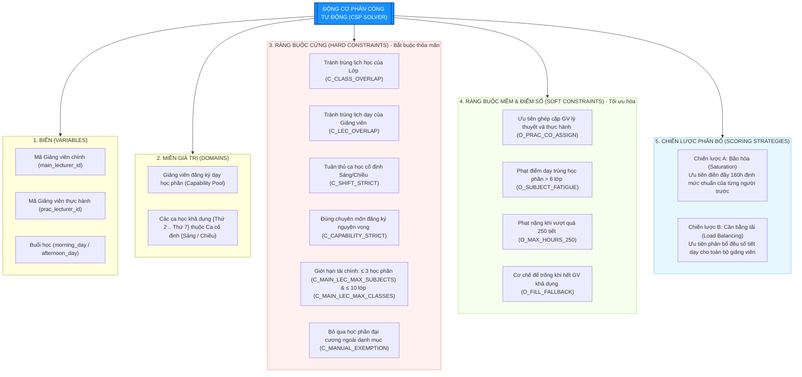
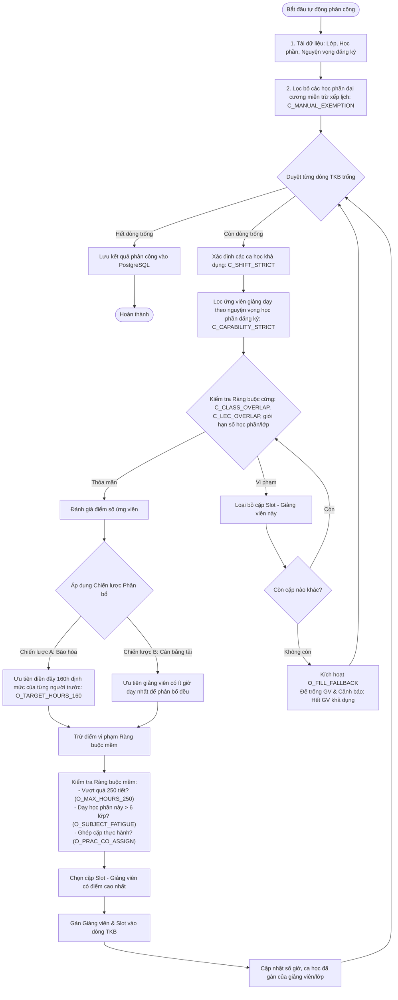

# CHƯƠNG 2. CÔNG NGHỆ SỬ DỤNG

## 2.1. Công nghệ xây dựng hệ thống nền tảng (Backend & Frontend)

Để xây dựng một hệ thống lập kế hoạch và phân công giảng dạy toàn diện, ổn định và có khả năng mở rộng tốt, việc lựa chọn kiến trúc và các công nghệ nền tảng đóng vai trò quyết định. Hệ thống được thiết kế theo mô hình kiến trúc Web Application hai lớp (Client-Server) hiện đại với sự phân tách rõ ràng về mặt trách nhiệm (Separation of Concerns). Phía máy chủ (Backend) chịu trách nhiệm quản trị cơ sở dữ liệu, thực thi các thuật toán tối ưu tổ hợp phức tạp và cung cấp các dịch vụ Web API chuẩn hóa. Phía máy trạm (Frontend) tập trung vào việc mang lại trải nghiệm người dùng tương tác thời gian thực, mượt mà và trực quan hóa các dữ liệu lịch biểu. Dưới đây là phân tích chi tiết về các công nghệ cốt lõi được lựa chọn ứng dụng trong hệ thống phân công giảng dạy cho Khoa Công nghệ Thông tin – Trường Đại học Đại Nam.

---

### 2.1.1. Tổng quan về ngôn ngữ Python

Python là một ngôn ngữ lập trình bậc cao, thông dịch, hướng đối tượng và đa mục đích, được phát triển bởi Guido van Rossum và ra mắt lần đầu vào năm 1991. Trải qua hơn ba thập kỷ phát triển, Python đã trở thành một trong những ngôn ngữ lập trình phổ biến nhất thế giới và là lựa chọn hàng đầu cho các ứng dụng từ phát triển web, khoa học dữ liệu cho đến trí tuệ nhân tạo. Trong dự án xây dựng hệ thống lập kế hoạch và giảng dạy này, Python được tin tưởng lựa chọn làm ngôn ngữ chủ đạo phía máy chủ nhờ những ưu điểm vượt trội sau:

*   **Cú pháp sáng sủa, dễ đọc và dễ bảo trì:** Triết lý thiết kế của Python nhấn mạnh vào độ thẩm mỹ và tính dễ đọc của mã nguồn (thể hiện qua tài liệu nổi tiếng *The Zen of Python*). Việc sử dụng khoảng trắng thụt lề (indentation) để phân cấp khối mã giúp mã nguồn Python cực kỳ gọn gàng, giảm thiểu mã mẫu dư thừa (boilerplate code). Điều này giúp rút ngắn chu kỳ phát triển phần mềm và tạo điều kiện thuận lợi cho việc bảo trì, chuyển giao mã nguồn.
*   **Hệ sinh thái thư viện dữ liệu khổng lồ:** Python sở hữu kho tàng thư viện bên thứ ba cực kỳ phong phú và mạnh mẽ thông qua trình quản lý gói PyPI. Đối với bài toán lập kế hoạch giảng dạy, khả năng tích hợp dễ dàng với các thư viện xử lý bảng biểu chuyên sâu (như Pandas) và các framework tối ưu hóa toán học giúp hệ thống xử lý trơn tru hàng ngàn dòng dữ liệu nghiệp vụ.
*   **Hỗ trợ đa phương thức lập trình:** Python cho phép lập trình viên linh hoạt áp dụng các phong cách lập trình hướng đối tượng (OOP), lập trình thủ tục (Procedural) hoặc lập trình hàm (Functional) tùy thuộc vào tính chất của từng module chức năng, giúp tối ưu hóa cấu trúc mã nguồn ở mức tối đa.

---

### 2.1.2. Tổng quan về TypeScript

Trong những ngày đầu của sự phát triển web, JavaScript là ngôn ngữ duy nhất chạy trên trình duyệt để tương tác giao diện. Tuy nhiên, JavaScript là một ngôn ngữ định kiểu động (dynamically typed) và yếu (weakly typed), dẫn đến việc các lỗi về kiểu dữ liệu (Type Errors) chỉ được phát hiện khi ứng dụng thực sự chạy trên môi trường thực tế (Runtime). Đối với một giao diện Workspace xếp lịch phức tạp có hàng chục thuộc tính dữ liệu đan xen, việc sử dụng JavaScript thuần túy tiềm ẩn rủi ro rất lớn về độ ổn định. Để khắc phục triệt để hạn chế này, hệ thống đã ứng dụng **TypeScript** làm ngôn ngữ lập trình chính cho toàn bộ mã nguồn Frontend.

TypeScript là một siêu tập (superset) mã nguồn mở của JavaScript được phát triển và bảo trì bởi tập đoàn Microsoft, được biên dịch trực tiếp ra JavaScript thuần trước khi chạy trên trình duyệt. TypeScript mang lại các giá trị cốt lõi vô cùng quan trọng cho dự án thông qua các cơ chế sau:

```
+---------------------------------------+
|  TypeScript: Kiểu dữ liệu tĩnh (Static Types)  |
|                                       |
|   +-------------------------------+   |
|   |  ES6+: Các tính năng JS mới   |   |
|   |                               |   |
|   |   +-----------------------+   |   |
|   |   | JavaScript thuần túy   |   |   |
|   |   +-----------------------+   |   |
|   +-------------------------------+   |
+---------------------------------------+
```

*   **Cơ chế Định kiểu Tĩnh (Static Typing):** TypeScript yêu cầu định nghĩa rõ ràng kiểu dữ liệu cho các biến, tham số truyền vào và kết quả trả về của hàm. Hệ thống định nghĩa các giao diện dữ liệu nghiêm ngặt cho các thực thể nghiệp vụ:
    *   `Lecturer`: Chứa thông tin chi tiết về mã, tên, chức vụ, loại giảng viên và số giờ dạy.
    *   `TimetableRow`: Định nghĩa cấu trúc một dòng thời khóa biểu gồm lớp, môn học, buổi và giảng viên được gán.
    *   `Preference`: Lưu trữ thông tin đăng ký nguyện vọng và vai trò của giảng viên.
    Nhờ đó, trình biên dịch TypeScript sẽ tự động phát hiện và cảnh báo ngay lập tức các lỗi sai lệch kiểu dữ liệu trong quá trình viết mã, triệt tiêu 95% các lỗi giao tiếp dữ liệu giữa Frontend và Backend.
*   **Hỗ trợ tối đa cho các công cụ lập trình (IDE Tooling):** Nhờ cơ chế định kiểu rõ ràng, các trình soạn thảo hiện đại (như VS Code hay Cursor) có thể cung cấp các tính năng tự động hoàn thành mã thông minh (IntelliSense), điều hướng mã nguồn nhanh chóng và hỗ trợ tái cấu trúc mã nguồn (Refactoring) quy mô lớn một cách an toàn mà không sợ phá vỡ các liên kết logic cũ.
*   **Khả năng tự động tài liệu hóa (Self-documenting):** Các Interfaces và Types trong TypeScript đóng vai trò như một bản đặc tả tài liệu sống động. Bất kỳ lập trình viên nào khi tham gia phát triển dự án chỉ cần nhìn vào định nghĩa kiểu dữ liệu là có thể lập tức hiểu được cấu trúc dữ liệu đầu ra đầu vào của từng component mà không cần đọc hàng ngàn dòng code logic bên dưới.

---

### 2.1.3. Tổng quan về ReactJS, Vite và thư viện giao diện Ant Design

Giao diện người dùng của hệ thống lập kế hoạch giảng dạy đòi hỏi tính tương tác cực kỳ cao, phản hồi nhanh chóng và bố cục trực quan sinh động để giảm thiểu áp lực cho cán bộ giáo vụ. Để hiện thực hóa mục tiêu đó, hệ thống sử dụng một bộ ba công nghệ Frontend hiện đại và mạnh mẽ hàng đầu hiện nay bao gồm ReactJS làm nền tảng ứng dụng, Vite làm công cụ đóng gói và Ant Design làm thư viện thành phần giao diện.

```
       +--------------------------------------------+
       |             FRONTEND APPLICATION           |
       +--------------------------------------------+
                              |
       +----------------------2----------------------+
       |                                             |
[ ReactJS (v19) ]                              [ Ant Design (v6) ]
- Kiến trúc Component-based                     - Drawer, Modal, Table
- State Management (useState, Context)         - Grid System, Typography
- Virtual DOM render tối ưu                    - Form Validation
       |                                             |
       +----------------------3----------------------+
                              |
                      [ Vite Bundler ]
                      - Native ESM Dev Server
                      - Siêu tốc độ biên dịch esbuild
```

#### A. ReactJS (Phiên bản 19)
ReactJS là một thư viện JavaScript mã nguồn mở được phát triển bởi Facebook dùng để xây dựng giao diện người dùng Single Page Application (SPA). ReactJS hoạt động dựa trên triết lý lập trình khai báo (Declarative UI) và kiến trúc dựa trên thành phần (Component-based).
- **Kiến trúc Component-based:** Giao diện hệ thống được chia nhỏ thành các thành phần độc lập, tự quản lý trạng thái riêng và có khả năng tái sử dụng rất cao (như thẻ thông tin giảng viên `LecturerCard`, dòng lịch học `TimetableRowComponent`, hộp thoại xác nhận `ConfirmationModal`). Điều này giúp mã nguồn Frontend cực kỳ ngăn nắp, dễ kiểm thử và dễ nâng cấp mở rộng.
- **Cơ chế Virtual DOM hiệu năng cao:** Thay vì cập nhật trực tiếp lên cấu trúc DOM của trình duyệt (vốn là một tác vụ tiêu tốn rất nhiều tài nguyên hiệu năng), ReactJS sử dụng một bản sao ảo của DOM trong bộ nhớ. Mỗi khi trạng thái (State) của ứng dụng thay đổi – ví dụ như khi cán bộ kéo giảng viên thả vào ô phân công, React sẽ tính toán sự khác biệt tối thiểu giữa DOM ảo cũ và mới (cơ chế Reconciliation/Diffing) và chỉ cập nhật đúng phần tử thay đổi lên DOM thật, mang lại tốc độ phản hồi cực kỳ nhanh chóng.
- **Quản trị trạng thái mạnh mẽ (State Management):** React cung cấp các Hooks mạnh mẽ như `useState`, `useEffect`, `useContext` và `useMemo` giúp hệ thống quản lý luồng dữ liệu một chiều (Unidirectional Data Flow) một cách rõ ràng và nhất quán, đảm bảo tính đồng bộ dữ liệu trên toàn bộ giao diện thời gian thực.

#### B. Vite (Phiên bản 8)
Vite là công cụ xây dựng (build tool) và đóng gói mã nguồn Frontend thế hệ mới được sáng tạo bởi Evan You (cha đẻ của VueJS). Trong nhiều năm qua, Webpack là tiêu chuẩn đóng gói dự án nhưng thường bộc lộ sự chậm trễ nghiêm trọng khi dự án phình to. Vite ra đời để giải quyết triệt để vấn đề này.
- **Tận dụng Native ESM:** Trong quá trình phát triển (development phase), Vite tận dụng cơ chế Native ES Modules (ESM) có sẵn trên các trình duyệt hiện đại. Vite không cần đóng gói toàn bộ dự án trước khi khởi động server, mà chỉ biên dịch và phân phối đúng file module mà trình duyệt yêu cầu, giúp thời gian khởi động server phát triển giảm xuống dưới 1 giây.
- **Biên dịch siêu tốc với esbuild:** Vite sử dụng `esbuild` – một công cụ biên dịch viết bằng ngôn ngữ Go – để đóng gói các thư viện phụ thuộc (dependencies), mang lại tốc độ nhanh hơn từ 10 đến 100 lần so với các công cụ viết bằng JavaScript truyền thống.
- **Hot Module Replacement (HMR) tức thời:** Khi lập trình viên thay đổi một dòng code giao diện, Vite chỉ cập nhật đúng module đó trên trình duyệt mà không cần tải lại toàn bộ trang web, giữ nguyên trạng thái làm việc hiện tại và tăng tốc độ phát triển lên gấp nhiều lần.

#### C. Thư viện giao diện Ant Design (Phiên bản 6)
Ant Design (AntD) là một trong những thư viện UI component chuyên nghiệp dành cho phân khúc doanh nghiệp phổ biến nhất thế giới. Được phát triển bởi các kỹ sư Ant Group, AntD cung cấp một hệ thống thiết kế (Design System) chuẩn hóa với tính thẩm mỹ cực kỳ cao.
- **Bộ thành phần phong phú và đồng nhất:** AntD cung cấp sẵn các component giao diện cao cấp đã được tối ưu hóa tối đa về mặt trải nghiệm người dùng và khả năng tương thích trình duyệt như bảng dữ liệu thông minh (`Table`), hộp thoại tương tác (`Modal`), bảng trượt thông tin (`Drawer`), các thanh lựa chọn tìm kiếm (`Select`, `Dropdown`), và hệ thống lưới (`Grid System`) hỗ trợ thiết kế đáp ứng (Responsive Design).
- **Thẩm mỹ cao và chuyên nghiệp:** Việc áp dụng triết lý thiết kế định hướng doanh nghiệp của AntD giúp giao diện của hệ thống lập kế hoạch giảng dạy thoát khỏi vẻ thô kệch của các phần mềm giáo vụ cũ, mang lại cảm giác cao cấp, sang trọng, tạo cảm hứng làm việc cho cán bộ khoa.
- **Cơ chế xác thực Form tự động:** AntD tích hợp sẵn thư viện quản lý Form vô cùng mạnh mẽ, hỗ trợ tự động kiểm tra tính hợp lệ của dữ liệu nhập vào (Validation) phía Client như kiểm tra định dạng email, bắt buộc nhập các ô dữ liệu gốc, giúp ngăn ngừa các dữ liệu rác trước khi gửi lên Backend.

---

### 2.1.4. Overview về FastAPI (Xây dựng Web API tốc độ cao)

Phía Backend của hệ thống lập kế hoạch giảng dạy đòi hỏi một framework có hiệu năng xử lý cực cao, hỗ trợ bất đồng bộ để đáp ứng tốt các tác vụ tính toán thuật toán CSP nặng nề và xử lý file Excel dung lượng lớn. **FastAPI** chính là sự lựa chọn tối ưu nhất đáp ứng hoàn hảo các tiêu chuẩn kỹ thuật khắt khe này.

FastAPI là một Web framework mã nguồn mở hiện đại, hiệu năng cao dùng để xây dựng các API bằng Python, được tạo ra bởi Sebastián Ramírez vào năm 2018. Dù ra đời muộn hơn Django và Flask, FastAPI đã nhanh chóng vươn lên dẫn đầu xu hướng phát triển Web API nhờ sở hữu các tính năng đột phá:

*   **Hiệu năng vượt trội (High Performance):** FastAPI là một trong những framework Python nhanh nhất hiện nay, có hiệu năng tiệm cận với NodeJS và Go. Có được tốc độ kinh ngạc này là nhờ FastAPI được xây dựng trực tiếp trên nền tảng của hai công nghệ cốt lõi: **Starlette** (đảm nhận chức năng định tuyến web siêu nhanh) và **Uvicorn** (máy chủ ASGI bất đồng bộ tốc độ cao).
*   **Hỗ trợ lập trình bất đồng bộ hoàn hảo (Asynchronous Programming):** FastAPI tích hợp sẵn cú pháp `async/await` của Python. Khi hệ thống nhận được các yêu cầu API đồng thời (ví dụ: hàng trăm giảng viên đăng ký nguyện vọng cùng lúc, hoặc cán bộ đang xuất Excel thời khóa biểu), cơ chế bất đồng bộ giúp máy chủ xử lý hiệu quả hàng ngàn kết nối song song mà không bị nghẽn (non-blocking), tối ưu hóa tài nguyên phần cứng server.
*   **Tự động tạo tài liệu API tương tác (Auto Documentation):** FastAPI tự động hóa hoàn toàn việc tạo tài liệu hướng dẫn sử dụng API theo tiêu chuẩn OpenAPI. Ngay khi cán bộ viết code định nghĩa các Endpoint, hệ thống sẽ tự động sinh ra trang Swagger UI trực quan tại đường dẫn `/docs`. Điều này giúp quá trình phối hợp kiểm thử tích hợp (Integration Test) giữa Frontend và Backend diễn ra cực kỳ suôn sẻ và minh bạch.
*   **Kiểm soát và chuẩn hóa dữ liệu mạnh mẽ bằng Pydantic:** FastAPI tích hợp chặt chẽ với thư viện Pydantic để thực hiện kiểm tra và chuẩn hóa dữ liệu (Data Validation & Serialization). Khi Frontend gửi một Request Body lên Backend, Pydantic sẽ tự động đối chiếu các trường thông tin đầu vào với Model đã định nghĩa. Nếu dữ liệu bị thiếu hoặc sai kiểu, FastAPI sẽ tự động trả về phản hồi lỗi chi tiết mã lỗi 422 (Unprocessable Entity) kèm mô tả chính xác trường bị lỗi, loại bỏ hoàn toàn các lỗi dữ liệu không hợp lệ đi sâu vào tầng Database.

---

### 2.1.5. Tổng quan về SQLAlchemy (ORM)

Trong kiến trúc phát triển phần mềm hiện đại, việc tương tác trực tiếp với cơ sở dữ liệu bằng các câu lệnh SQL thuần túy (Raw SQL) lồng ghép trong mã nguồn bộc lộ nhiều hạn chế nghiêm trọng như khó bảo trì, dễ xảy ra lỗi cú pháp khi cơ sở dữ liệu thay đổi cấu trúc, và đặc biệt là nguy cơ cao bị tấn công bảo mật thông qua lỗ hổng SQL Injection. Để giải quyết triệt để bài toán này, hệ thống đã ứng dụng thư viện **SQLAlchemy** làm cầu nối tương tác dữ liệu.

SQLAlchemy là thư viện ánh xạ quan hệ đối tượng (ORM - Object-Relational Mapping) mạnh mẽ và phổ biến nhất trong hệ sinh thái Python. Nó cung cấp cho lập trình viên một giải pháp trừu tượng hóa cơ sở dữ liệu toàn diện:

```
+--------------------------------------------------------+
|                   MÃ NGUỒN PYTHON (APP)                |
|  (Thao tác với đối tượng: lecturer.name = "Dũng")      |
+--------------------------------------------------------+
                           |
+--------------------------v-----------------------------+
|                     SQLALCHEMY ORM                     |
|  (Tự động ánh xạ đối tượng thành các câu lệnh SQL)     |
+--------------------------------------------------------+
                           |
+--------------------------v-----------------------------+
|              TẦNG TRỪU TƯỢNG HÓA DATABASE              |
|  (Hỗ trợ SQLite, PostgreSQL, MySQL...)                 |
+--------------------------------------------------------+
```

*   **Trừu tượng hóa Cơ sở dữ liệu và Độc lập Hệ quản trị:** SQLAlchemy cho phép định nghĩa cấu trúc bảng dữ liệu dưới dạng các class Python thuần túy. Lập trình viên tương tác với cơ sở dữ liệu thông qua các phương thức hướng đối tượng (ví dụ: `db.query(Lecturer).filter_by(id=1).first()`). SQLAlchemy sẽ tự động biên dịch các phương thức này thành các câu lệnh SQL tương ứng với hệ quản trị cơ sở dữ liệu đang sử dụng. Điều này mang lại sự linh hoạt tuyệt đối, cho phép hệ thống dễ dàng chuyển đổi hệ quản trị cơ sở dữ liệu từ SQLite (dùng khi lập trình cục bộ) sang PostgreSQL (khi triển khai production thực tế) mà không cần thay đổi bất kỳ dòng code logic nghiệp vụ nào.
*   **Quản trị Session và Transaction an toàn:** SQLAlchemy cung cấp cơ chế quản lý Session (phiên làm việc) mạnh mẽ. Toàn bộ các thao tác thêm, sửa, xóa dữ liệu trong một phiên làm việc được gom lại dưới dạng một Transaction. Nếu một thao tác trong chuỗi bị lỗi, SQLAlchemy hỗ trợ rollback toàn bộ để đưa cơ sở dữ liệu về trạng thái an toàn trước đó, đảm bảo tính toàn vẹn dữ liệu tuyệt đối của thời khóa biểu.
*   **Phòng ngừa tấn công SQL Injection tự động:** Nhờ cơ chế tham số hóa các truy vấn (Parameterized Queries), SQLAlchemy tự động lọc và vô hiệu hóa tất cả các ký tự đặc biệt nguy hiểm trong dữ liệu nhập vào từ người dùng, xây dựng một lá chắn bảo mật vững chắc cho tầng lưu trữ dữ liệu của khoa.

---

### 2.1.6. Tổng quan về Hệ quản trị Cơ sở dữ liệu (PostgreSQL/SQLite)

Cơ sở dữ liệu là trái tim của hệ thống lập kế hoạch giảng dạy, nơi lưu giữ toàn bộ thông tin nhạy cảm và quan trọng của Khoa như hồ sơ giảng viên, định mức giờ dạy, khung chương trình đào tạo của từng chuyên ngành và lịch sử các đợt nguyện vọng. Để tối ưu hóa hiệu quả hoạt động giữa hai giai đoạn phát triển phần mềm và vận hành thực tế, hệ thống áp dụng chiến lược sử dụng linh hoạt hai hệ quản trị cơ sở dữ liệu quan hệ: **SQLite** và **PostgreSQL**.

#### A. SQLite (Hệ quản trị Cơ sở dữ liệu Nhẹ cho Phát triển)
SQLite là một thư viện phần mềm cung cấp hệ quản trị cơ sở dữ liệu quan hệ dung lượng siêu nhẹ, không cần cấu hình máy chủ độc lập (Serverless). Toàn bộ cơ sở dữ liệu của SQLite được gói gọn trong duy nhất một tệp tin vật lý nằm trực tiếp trên ổ đĩa cứng của máy trạm.
*   **Lợi ích trong môi trường phát triển (Development):** Nhờ tính chất không cần cài đặt dịch vụ nền hay cấu hình cổng kết nối phức tạp, SQLite giúp lập trình viên khởi động và chạy thử dự án ngay lập tức. Tốc độ đọc ghi cục bộ cực nhanh của SQLite giúp việc chạy thử các bộ dữ liệu nhỏ và các ca kiểm thử tự động (Unit Tests) diễn ra vô cùng nhanh chóng và thuận tiện.

#### B. PostgreSQL (Hệ quản trị Cơ sở dữ liệu Cao cấp cho Vận hành Thực tế)
PostgreSQL (thường gọi là Postgres) là một hệ quản trị cơ sở dữ liệu quan hệ đối tượng mã nguồn mở mạnh mẽ, ổn định và có lịch sử phát triển hơn 30 năm. Postgres nổi tiếng thế giới nhờ tuân thủ nghiêm ngặt các tiêu chuẩn chuẩn hóa cơ sở dữ liệu và khả năng xử lý các tác vụ quy mô lớn của doanh nghiệp.
*   **Lợi ích trong môi trường vận hành thực tế (Production):** 
    *   *Khả năng chịu tải và đồng thời cao:* PostgreSQL hỗ trợ cơ chế MVCC (Multi-Version Concurrency Control) tiên tiến, cho phép nhiều người dùng đồng thời thực hiện thao tác ghi và đọc dữ liệu mà không gây ra tình trạng khóa bảng dữ liệu lẫn nhau, cực kỳ phù hợp khi hàng trăm giảng viên truy cập hệ thống đăng ký nguyện vọng cùng một thời điểm.
    *   *Hỗ trợ toàn diện ACID Transactions:* Đảm bảo các giao dịch dữ liệu (như phân công gán lịch chéo lớp học phần) được thực hiện một cách Nguyên tố, Nhất quán, Biệt lập và Bền vững, loại bỏ hoàn toàn các rủi ro mất mát hay sai lệch số liệu lịch biểu khi xảy ra sự cố đột ngột.
    *   *Tích hợp sao lưu tự động:* Hỗ trợ lập lịch sao lưu cơ sở dữ liệu định kỳ tự động (`PROJECT_1_SCHEDULE_BACKUP`), bảo vệ an toàn tuyệt đối dữ liệu lịch sử giảng dạy của Khoa qua nhiều năm đào tạo học thuật.

---

## 2.2. Công nghệ hỗ trợ xử lý nghiệp vụ nâng cao

Để giải quyết triệt để các bài toán nghiệp vụ mang tính đặc thù và phức tạp nhất của Khoa Công nghệ Thông tin – Trường Đại học Đại Nam, hệ thống đã ứng dụng các công nghệ và giải thuật chuyên sâu, giúp tối ưu hóa tối đa trải nghiệm người dùng và tự động hóa quy trình nghiệp vụ. Dưới đây là phân tích chi tiết về các công nghệ hỗ trợ xử lý nghiệp vụ nâng cao được triển khai trong hệ thống.

---

### 2.2.1. Thư viện Dnd-kit hỗ trợ thao tác kéo thả (Drag & Drop) mượt mà

Giao diện tương tác kéo thả trong không gian xếp lịch (Timetable Workspace) là tính năng cốt lõi ảnh hưởng trực tiếp đến hiệu suất làm việc của cán bộ khoa. Để xây dựng một trải nghiệm kéo thả trực quan và đạt tốc độ phản hồi tối ưu trên nền tảng React, hệ thống đã sử dụng bộ thư viện **@dnd-kit** (bao gồm `@dnd-kit/core`, `@dnd-kit/sortable`, và `@dnd-kit/utilities`).

So với các giải pháp kéo thả truyền thống như React DnD hay React Beautiful DnD, `@dnd-kit` được ưu tiên lựa chọn nhờ sở hữu các đặc tính kỹ thuật vượt trội:

*   **Kiến trúc Modul hóa cực kỳ mỏng nhẹ:** Thư viện được chia nhỏ thành nhiều gói riêng biệt, cho phép Frontend chỉ import đúng những module thực sự cần thiết, từ đó tối ưu hóa dung lượng gói build và tăng tốc độ tải trang web.
*   **Hỗ trợ cảm biến đa dạng (Sensors):** `@dnd-kit` tích hợp sẵn các bộ cảm biến giúp nhận diện chính xác ý định tương tác của người dùng trên nhiều thiết bị đầu cuối khác nhau:
    *   *Pointer Sensor:* Nhận diện thao tác click chuột chuẩn xác trên máy tính để bàn.
    *   *Touch Sensor:* Hỗ trợ vuốt chạm nhạy bén trên các thiết bị màn hình cảm ứng di động.
    *   *Keyboard Sensor:* Bảo đảm khả năng điều hướng kéo thả bằng bàn phím phục vụ tiêu chuẩn Accessibility (A11y).
*   **Hiệu năng Render tối ưu với React 19:** Thư viện không can thiệp trực tiếp vào cấu trúc DOM thật mà hoạt động dựa trên các trạng thái và thuộc tính biến đổi của React, kết hợp với cơ chế dịch chuyển phần tử bằng CSS Transform thông qua helper `CSS.Translate.toString(transform)`. Điều này giúp giao diện kéo thả giảng viên từ bể đề xuất vào ô phân công đạt độ mượt mà 60 khung hình trên giây (60 FPS), hoàn toàn không bị hiện tượng giật lag ngay cả khi xử lý hàng trăm dòng lớp học phần đồng thời.
*   **Cơ chế DragOverlay độc đáo:** Hệ thống sử dụng component `<DragOverlay>` để tạo ra một bản sao ảo của thẻ giảng viên bay lơ lửng theo con trỏ chuột trong suốt quá trình kéo. Cơ chế này giúp giữ nguyên cấu trúc layout gốc tại vị trí ban đầu, mang lại hiệu ứng thị giác cực kỳ cao cấp và chuyên nghiệp.

---

### 2.2.2. Thuật toán thỏa mãn ràng buộc (CSP) ứng dụng trong tự động hóa xếp lịch

Trọng tâm xử lý thông minh của hệ thống nằm ở **Động cơ phân công tự động (Auto-Assignment Engine)** đặt tại Backend, được xây dựng dựa trên mô hình bài toán **Thỏa mãn ràng buộc (Constraint Satisfaction Problem - CSP)** kết hợp giải thuật tìm kiếm heuristic cục bộ. Bài toán CSP được định nghĩa toán học thông qua bộ ba yếu tố: tập các biến $X$ (các phần tử cần gán giá trị), miền giá trị khả dụng $D$ của từng biến, và tập các ràng buộc $C$ (bao gồm ràng buộc cứng bắt buộc và ràng buộc mềm tối ưu hóa).

Mô hình bài toán phân công thời khóa biểu tự động trong hệ thống được cấu trúc hóa dưới dạng một bài toán CSP gồm đầy đủ các thành phần cốt lõi (Biến, Miền giá trị, Ràng buộc cứng, Ràng buộc mềm và Chiến lược phân bổ) được thể hiện qua sơ đồ cấu trúc dưới đây:



Tiến trình thực thi và giải quyết bài toán phân công tự động của động cơ CSP Solver được triển khai tuần tự theo sơ đồ thuật toán dưới đây:



Dưới đây là mô tả chi tiết 4 giai đoạn hoạt động cốt lõi của động cơ CSP Solver được thiết lập trong tệp tin `auto_assign.py`:

#### A. Đầu vào của thuật toán (Input)
Để bắt đầu quá trình tự động hóa xếp lịch, động cơ lập lịch nạp các nguồn thông tin đầu vào từ cơ sở dữ liệu bao gồm:
1. **Dòng thời khóa biểu trống (Timetable Slots Grid)**: Các dòng lịch biểu chưa được gán giảng viên, mang các thuộc tính ràng buộc cố định như Lớp học phần (`class_name`), Học phần (`subject_id`), và Buổi học cố định (`fixed_shift` - Sáng/Chiều).
2. **Hồ sơ năng lực và nguyện vọng của Giảng viên (Lecturer Capability & Preference Pool)**: Danh sách đăng ký dạy học phần được trích xuất từ đợt nguyện vọng của học kỳ. Dữ liệu này phân cấp rõ ràng giảng viên đăng ký vai trò lý thuyết (`is_main_lecturer = True`) và giảng viên thực hành.
3. **Chiến lược phân bổ (Scoring Strategy Selection)**: Lựa chọn của người quản trị về phương án phân phối giờ giảng giữa **Bão hòa (Saturation - Chiến lược A)** và **Cân bằng tải (Load Balancing - Chiến lược B)**.

#### B. Lọc và kiểm tra ràng buộc cứng - Cách xử lý xung đột (Filtering & Hard Constraints)
Giai đoạn này hoạt động như một bộ lọc (Filter) nghiêm ngặt để loại bỏ mọi phương án gán gây xung đột kỹ thuật hoặc vượt ngưỡng năng lực vật lý của giảng viên. Cặp giá trị (Buổi học - Giảng viên) được chấp nhận nếu vượt qua tất cả các kiểm tra sau:
1. **Tránh trùng lịch học của Lớp (`C_CLASS_OVERLAP`)**: Một lớp học phần tại một buổi chỉ được phép xếp tối đa một học phần. Hệ thống sử dụng tập hợp `class_slots` để theo dõi và loại trừ các buổi bị trùng của lớp.
2. **Tránh trùng lịch dạy của Giảng viên (`C_LEC_OVERLAP`)**: Một giảng viên (cho cả vai trò giảng dạy chính và thực hành) không thể cùng lúc giảng dạy ở hai lớp khác nhau trong cùng một ca học. Việc kiểm soát dựa trên tập hợp ca dạy của giảng viên `lec_slots`.
3. **Tuân thủ buổi cố định (`C_SHIFT_STRICT`)**: Lịch xếp phải tuân thủ nghiêm ngặt thuộc tính ca học đã chọn trước (`Sáng` tương ứng với các ca `S-Thứ_x`, `Chiều` tương ứng với các ca `C-Thứ_x`).
4. **Đúng chuyên môn đăng ký (`C_CAPABILITY_STRICT`)**: Giảng viên chỉ được xem xét nếu học phần giảng dạy nằm trong danh sách đăng ký đã được phê duyệt trong đợt nguyện vọng.
5. **Giới hạn số học phần của một giảng viên chính (`C_MAIN_LEC_MAX_SUBJECTS`)**: Số lượng học phần khác biệt tối đa mà một giảng viên chính được gán trong học kỳ không vượt quá $3$ học phần (`MAX_DISTINCT_SUBJECTS_MAIN = 3`).
6. **Giới hạn tổng số lớp của một giảng viên chính (`C_MAIN_LEC_MAX_CLASSES`)**: Một giảng viên chính không thể gán quá $10$ lớp học phần trong cùng một học kỳ (`MAX_CLASSES_MAIN = 10`).
7. **Bỏ qua học phần đại cương ngoài danh mục (`C_MANUAL_EXEMPTION`)**: Nếu học phần không có bất kỳ giảng viên nào đăng ký nguyện vọng trong hệ thống (thường là học phần đại cương do Khoa khác đảm nhiệm hoặc học phần tự học), động cơ sẽ tự động bỏ qua để tập trung xử lý các học phần chuyên ngành của Khoa CNTT.

#### C. Chấm điểm Heuristic và Tiêu chí tối ưu (Scoring & Soft Constraints)
Tất cả các phương án gán hợp lệ (thỏa mãn 100% ràng buộc cứng) sẽ được đưa vào hàm chấm điểm Heuristic `_score_lecturer` để xếp hạng. Điểm số được tính toán động dựa trên trạng thái tích lũy của hệ thống tại thời điểm duyệt và áp dụng các tiêu chí tối ưu hóa sau:

1. **Ưu tiên theo Chiến lược gán**:
   * **Chiến lược A - Bão hòa (Saturation)**: Hệ thống tối ưu hóa bằng cách điền đầy định mức giờ chuẩn là $160$ tiết (`TARGET_HOURS = 160`) cho một giảng viên trước khi chuyển sang giảng viên tiếp theo.
     $$\text{Score} = \text{Tổng số giờ đã gán hiện tại (nếu } < 160)$$
     Nếu giảng viên đã đạt mốc định mức tối thiểu $160$ tiết, họ sẽ bị phạt nặng $-5,000$ điểm để thuật toán ưu tiên chọn những giảng viên chưa đủ định mức.
   * **Chiến lược B - Cân bằng tải (Load Balancing)**: Hệ thống ưu tiên giảng viên có số giờ giảng dạy tích lũy thấp nhất nhằm phân phối đều tải công việc trong toàn Khoa.
     $$\text{Score} = -\text{Tổng số giờ đã gán hiện tại}$$
2. **Phạt nặng vượt tải tối đa (`O_MAX_HOURS_250`)**: Nhằm bảo vệ sức khỏe và chất lượng giảng dạy, hệ thống áp đặt trần giờ giảng trần mềm là $250$ tiết (`SOFT_MAX_HOURS = 250`). Nếu việc gán thêm học phần làm số giờ dự kiến vượt quá $250$ tiết, phương án gán sẽ bị phạt cực nặng $-10,000$ điểm.
3. **Phạt tránh mệt mỏi bài giảng (`O_SUBJECT_FATIGUE`)**: Nhằm tránh sự mệt mỏi khi giảng dạy lặp đi lặp lại cùng một nội dung, một giảng viên không nên dạy quá $6$ lớp cho cùng một học phần (`MAX_SAME_SUBJECT_CLASSES = 6`). Nếu vượt quá, điểm số của phương án gán sẽ bị trừ $-2,000$ điểm.
4. **Ưu tiên ghép cặp giảng viên thực hành (`O_PRAC_CO_ASSIGN`)**: Với các học phần có giờ thực hành và có giảng viên thực hành đăng ký nguyện vọng, hệ thống sẽ thực hiện gọi hàm `_find_best_prac` để đồng thời tìm và ghép cặp giảng viên thực hành tối ưu nhất dựa trên cùng tiêu chí tính điểm giờ dạy.

#### D. Đầu ra của thuật toán (Output)
Sau khi tính toán điểm số Heuristic cho tất cả các kết hợp hợp lệ, động cơ phân công sẽ đưa ra kết quả đầu ra:
1. **Cập nhật thời khóa biểu tối ưu (Optimal Timetable Assignment)**: Cập nhật trực tiếp mã định danh của giảng viên chính (`main_lecturer_id`), giảng viên thực hành (`prac_lecturer_id`) và buổi học được xếp (`morning_day` / `afternoon_day`) vào bảng cơ sở dữ liệu `TimetableRow`.
2. **Cơ chế dự phòng để trống (`O_FILL_FALLBACK`)**: Trong trường hợp dữ liệu nguồn bị nghẽn (không có giảng viên nào đăng ký học phần hoặc tất cả các giảng viên đăng ký đều vi phạm ràng buộc cứng về lịch trùng hay quá tải giới hạn), động cơ sẽ giữ nguyên trạng thái trống của giảng viên và ghi nhận cảnh báo *"Hết giảng viên chính khả dụng"*.
3. **Bảng thống kê và cảnh báo vi phạm (Warnings & Violations Dashboard)**: Toàn bộ các vi phạm về ràng buộc mềm (giảng viên vượt quá $250$ tiết, dạy một học phần quá $6$ lớp) hoặc các cảnh báo thiếu giảng viên đều được lưu trữ vào đối tượng `AssignmentResult` và phản hồi trực quan về giao diện quản trị viên (Frontend) dưới dạng các cảnh báo chuông và highlight, giúp cán bộ giáo vụ nhanh chóng phát hiện và xử lý thủ công các trường hợp đặc biệt.

---

### 2.2.3. Các công nghệ hỗ trợ bảo mật và tiện ích (PyJWT, Bcrypt, Pandas xử lý Excel)

Để hoàn thiện một hệ thống phần mềm đạt chuẩn doanh nghiệp, bên cạnh các nghiệp vụ lõi, hệ thống cũng tích hợp các thư viện tiện ích mạnh mẽ giúp bảo vệ an toàn dữ liệu và tối ưu hóa quy trình nhập xuất dữ liệu quy mô lớn:

*   **PyJWT (Xác thực phi trạng thái):** Hệ thống sử dụng thư viện PyJWT để phát hành và kiểm tra các mã thông báo JSON Web Token (JWT). Khi người dùng đăng nhập thành công, máy chủ sẽ ký và cấp một token JWT chứa thông tin định danh và quyền hạn của người dùng. Token này được lưu trữ an toàn phía Frontend và đính kèm vào tiêu đề (Header) của mỗi yêu cầu API. Cơ chế xác thực phi trạng thái (Stateless Authentication) này giúp giảm tải cho server do không phải duy trì bộ nhớ session, đồng thời ngăn chặn hiệu quả các cuộc tấn công giả mạo yêu cầu (CSRF).
*   **Bcrypt (Mã hóa mật khẩu):** Mật khẩu của giảng viên và cán bộ quản lý là thông tin nhạy cảm bắt buộc phải được bảo vệ tuyệt đối. Thư viện Bcrypt của Python được ứng dụng để băm mật khẩu (hashing) kết hợp với kỹ thuật thêm muối (salting) ngẫu nhiên trước khi lưu trữ vào cơ sở dữ liệu. Bcrypt sử dụng giải pháp băm chậm có chủ đích (adaptive hashing algorithm), giúp triệt tiêu hoàn toàn khả năng bị giải mã ngược mật khẩu ngay cả khi cơ sở dữ liệu bị rò lọt ra bên ngoài.
*   **Pandas & Openpyxl (Tiện ích Import/Export Excel):** Quy trình giáo vụ khoa gắn liền với các báo cáo Excel của nhà trường.
    *   *Pandas:* Thư viện xử lý dữ liệu mạnh mẽ bậc nhất của Python giúp Backend dễ dàng đọc các tệp tin Excel tải lên, tự động làm sạch dữ liệu, xử lý các ô trống và phân tích cấu trúc dữ liệu để import hàng loạt vào Database.
    *   *Openpyxl:* Đóng vai trò là động cơ ghi file (write engine), hỗ trợ kết xuất bảng phân công thời khóa biểu hoàn chỉnh ra file Excel chuẩn hóa với đầy đủ định dạng cột, màu sắc cảnh báo trực quan để sẵn sàng gửi lên Ban giám hiệu nhà trường.

---

## 2.3. Kết luận chương

Chương 2 đã cung cấp một cái nhìn tổng quan, chi tiết và có hệ thống về toàn bộ kiến trúc công nghệ được ứng dụng trong đề tài **"Xây dựng hệ thống lập kế hoạch và giảng dạy cho Khoa Công nghệ Thông tin – Trường Đại học Đại Nam"**. Sự kết hợp hài hòa giữa các ngôn ngữ hiện đại (Python, TypeScript), các framework hiệu năng cao (FastAPI, ReactJS), cùng các công cụ xây dựng và đóng gói tiên tiến (Vite, Ant Design, SQLAlchemy ORM) đã tạo nên một nền tảng vững chắc cho hệ thống.

Đồng thời, việc nghiên cứu chuyên sâu các giải pháp công nghệ nâng cao như thao tác tương tác kéo thả mượt mà với `@dnd-kit`, động cơ xếp lịch tự động hóa dựa trên giải thuật CSP thông minh với các chiến lược bão hòa/cân bằng tải, cùng các thư viện bảo mật và tiện ích như PyJWT, Bcrypt và Pandas đã chứng minh tính khả thi, độ tin cậy và khả năng ứng dụng thực tế cao của phần mềm. Đây chính là tiền đề kỹ thuật quan trọng để bước sang Chương 3 – tập trung vào phân tích chi tiết thiết kế hệ thống và mô hình hóa cơ sở dữ liệu thực tế của dự án.
