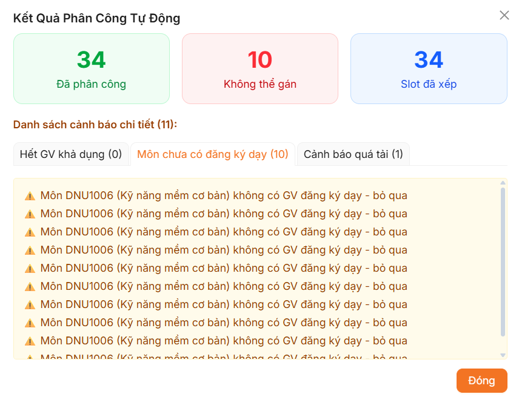

# 4.4. Kết quả kiểm thử trên bộ dữ liệu thực tế

Nhằm đánh giá hiệu năng, tính ổn định và mức độ thực tế của động cơ phân công thời khóa biểu tự động (CSP Solver), hệ thống đã tiến hành thực thi thử nghiệm với bộ dữ liệu thực tế được cung cấp bởi Khoa Công nghệ Thông tin – Trường Đại học Đại Nam.

### 4.4.1. Bộ dữ liệu kiểm thử thực tế

Bộ dữ liệu đầu vào phục vụ cho việc kiểm thử thực tế bao gồm ba nguồn thông tin chính yếu sau:
1. **Bộ dữ liệu chương trình đào tạo của khóa 19 (K19) - Khoa Công nghệ Thông tin, Trường Đại học Đại Nam**: Cung cấp khung chương trình học, danh sách các học phần lý thuyết và thực hành, cùng số tiết tương ứng của từng học phần.
2. **Bộ dữ liệu giảng viên Khoa Công nghệ Thông tin, Trường Đại học Đại Nam (cập nhật tháng 1 năm 2026)**: Hồ sơ chi tiết về đội ngũ giảng viên cơ hữu và thỉnh giảng của Khoa CNTT, bao gồm định mức giờ giảng và ca dạy khả dụng.
3. **Bộ dữ liệu nguyện vọng giảng dạy của giảng viên Khoa Công nghệ Thông tin, Trường Đại học Đại Nam (cập nhật tháng 1 năm 2026)**: Bản ghi chi tiết các nguyện vọng đăng ký giảng dạy học phần của từng giảng viên trong học kỳ.

---
> **[NƠI ĐẶT ẢNH BỘ DỮ LIỆU THỰC TẾ]**
> *(Lưu ý: Chèn ảnh chụp minh họa bộ dữ liệu chương trình đào tạo, danh sách giảng viên và nguyện vọng đăng ký tại đây)*
---

### 4.4.2. Kết quả kiểm thử và đánh giá

Quá trình kiểm thử được thực hiện trên mẫu giả lập thời khóa biểu gồm **12 lớp học phần** thuộc Khoa Công nghệ Thông tin khóa 19, bao trọn 3 chuyên ngành đào tạo: **Công nghệ thông tin (CNTT)**, **Hệ thống thông tin (HTTT)**, và **Khoa học máy tính (KHMT)**.

Kết quả chạy thực tế của động cơ CSP Solver được ghi nhận cụ thể như sau:
* **Số slot đã phân công thành công**: **34 slots** (Gán thành công giảng viên chính/phụ và xếp lịch buổi học tối ưu).
* **Số slot không thể gán**: **10 slots**.
* **Nguyên nhân không thể gán**: Toàn bộ 10 slots này đều thuộc học phần **DNU1006 (Kỹ năng mềm cơ bản)**. Đây là học phần kỹ năng bổ trợ chung của nhà trường (không phải học phần chuyên ngành Công nghệ thông tin) nên trong đợt đăng ký nguyện vọng cập nhật tháng 01/2026 không có giảng viên nào thuộc Khoa CNTT đăng ký giảng dạy học phần này.
* **Cảnh báo nghiệp vụ đi kèm**: Hệ thống xuất ra 1 cảnh báo quá tải giờ giảng (đảm bảo tính minh bạch cho cán bộ giáo vụ điều chỉnh) và 10 cảnh báo bỏ qua do học phần chưa có đăng ký giảng dạy.

---

---

### 4.4.3. Kết luận kiểm thử

Thuật toán tự động xếp lịch dựa trên mô hình CSP đã hoạt động đúng như thiết kế:
* Đáp ứng đầy đủ các ràng buộc cứng (không trùng lịch giảng viên, không trùng lịch lớp, đúng chuyên môn giảng dạy).
* Đưa ra cảnh báo nghiệp vụ rõ ràng, chi tiết cho giáo vụ đối với những học phần bị thiếu giảng viên đăng ký (`DNU1006`).
* Cơ chế dự phòng `O_FILL_FALLBACK` đã hoạt động chính xác khi để trống các slot của học phần kỹ năng mềm để giáo vụ Khoa thực hiện liên hệ gán giảng viên ngoài Khoa hoặc thỉnh giảng thủ công.

**Đánh giá chung: Kết quả thực nghiệm đạt yêu cầu đề ra.**
